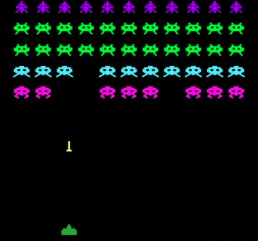

Multithreaded Space Invaders Game
=================================

This is an implementation of the arcade video game [Space Invaders](https://en.wikipedia.org/wiki/Space_Invaders). In this version each enemy (space invader) will be independent and the number of enemies is configurable.



Game Rules
----------
- The player controls the `Ship` with the left and right arrows.
- The playar can shoot by pressing the space bar.
- Space Invaders are autonomous entities that will move and shoot in a random way.
- Space Invaders number can be configured on game's start by running `./space-invaders [ #OfEnemies ]` **with a maximum of 300**.
- The score is displayed at the bottom of the screen.
- Player loses when it has been shooted 10 times.
- The player wins the game when it has taken down all its enemies in the map.

Compile the game
----------------

To compile the game just use the `Makefile`. Please make sure that you have `Golang` and `Homebrew` installed and that you are runnning the game in a bash terminal.
To compile:
```
make
```
Run the game
----------------
To run the game just use the `space-invaders` file and add the number of enemies at the beginning. The number of enemies should be **300 as maximum**:
```
./space-invaders [ #OfEnemies ]
```

References
-----------
This implementation was based on the tutorial [Gaming in Go](https://www.youtube.com/playlist?list=PLOXvU5Ov-cqpjd1_OnczdizY0I64OfH-T) by Velovix, from there we took some of the structure and improved the code.
